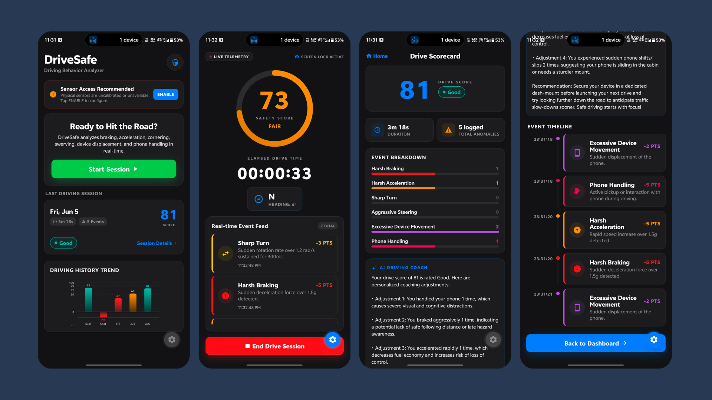

# DriveSafe 🚗💨

DriveSafe is a premium React Native / Expo application designed to analyze driving behavior in real-time. By utilizing high-frequency device telemetry (accelerometer, gyroscope, device motion, magnetometer), it detects unsafe driving events, computes an overall safety score, and provides a driving session summary scorecard.

---

## 📱 Tech Stack
* **Framework**: React Native & Expo (v55)
* **Routing**: Expo Router (File-based navigation)
* **Styling**: Vanilla React Native StyleSheet with custom dark/neon premium theme system
* **Animations**: React Native Reanimated (v4)
* **State Management**: React Hooks (Reducer / Context pattern)
* **Data Storage**: AsyncStorage (Persisted drive session history)
* **Sensors**: Expo Sensors

---

## 🛠️ Sensors Used
1. **Accelerometer**: Measures acceleration force along three axes (X, Y, Z). Crucial for capturing sudden linear shifts in speed (harsh braking, rapid acceleration).
2. **Gyroscope**: Captures angular velocity (degrees/radians per second of rotation). Used to measure turn intensity and steering stability.
3. **Device Motion**: Combines hardware data to calculate device-specific user acceleration (free of gravitational pull) and rotation rate (alpha, beta, gamma). Utilized to detect phone usage and displacement.
4. **Magnetometer**: Measures magnetic fields to calculate absolute heading direction, supplying data to the live telemetry compass.

---

## 📈 Event Detection Strategy
DriveSafe implements a rolling buffer architecture maintaining **strictly a maximum of 500ms of history** for accelerometer and gyroscope streams. This keeps detection lightweight and latency-free. Each event uses custom cooldown windows (debouncing) to prevent double-counting.

* **Harsh Braking**: Scans the 500ms accelerometer buffer for rapid positive changes along the longitudinal axis (representing forward force projection under hard braking).
* **Harsh Acceleration**: Scans the 500ms accelerometer buffer for rapid negative changes along the longitudinal axis (forward launch projection).
* **Sharp Turn**: Scans the gyroscope buffer for a sustained high-intensity rotation on the yaw axis (Z-axis).
* **Aggressive Steering**: Identifies erratic steering adjustments or rapid lane weaving by scanning for moderate yaw rotation sustained over a longer interval.
* **Excessive Device Movement**: Derivative calculation of the accelerometer vector magnitude difference over time to detect if the phone slips from its holder or moves inside the cabin.
* **Phone Handling**: Correlates high angular rotation rate on horizontal/vertical axes with non-gravitational user acceleration (measuring the action of picking up and operating the device).

---

## ⚙️ Threshold Values Chosen

| Event | Metric Threshold | Duration | Cooldown (Debounce) | Description |
| :--- | :--- | :--- | :--- | :--- |
| **Harsh Braking** | $> 1.5g$ delta | $< 200\text{ms}$ | $2000\text{ms}$ | Sudden, emergency-level stops |
| **Harsh Acceleration** | $< -1.5g$ delta | $< 200\text{ms}$ | $2000\text{ms}$ | Aggressive throttle/engine revving |
| **Sharp Turn** | $> 1.2\text{ rad/s}$ | $> 300\text{ms}$ | $1500\text{ms}$ | Fast, unstable turning maneuver |
| **Aggressive Steering** | $> 0.8\text{ rad/s}$ | $> 500\text{ms}$ | $1000\text{ms}$ | Swerving or rapid lane weaving |
| **Excessive Movement**| $> 2.0g\text{/s}$ | Instantaneous | $3000\text{ms}$ | Sudden phone fall or slide |
| **Phone Handling** | Rotation $> 1.5\text{ rad/s}$ & User Accel $> 0.5g$ | Instantaneous | $5000\text{ms}$ | Active manual phone usage |

---

## 🧮 Driving Score Calculation Logic
Every driving session starts with a **base safety score of 100**. When driving events are detected, points are directly deducted from the score. Deductions can accumulate past zero, resulting in a negative score for highly unsafe sessions.

### Score Deductions per Event:
* 🔴 **Harsh Braking**: $-5$ pts
* 🟠 **Harsh Acceleration**: $-5$ pts
* 🟡 **Sharp Turn**: $-3$ pts
* 🟡 **Aggressive Steering**: $-2$ pts
* 🟣 **Excessive Device Movement**: $-2$ pts
* 🔴 **Phone Handling**: $-5$ pts

### Rating Scale:
* **Excellent** (Score $\ge 90$): Green indicator (`#34C759`)
* **Good** (Score $75 - 89$): Teal indicator (`#14B8A6`)
* **Fair** (Score $60 - 74$): Amber indicator (`#FF9500`)
* **Needs Improvement** (Score $< 60$): Red indicator (`#FF3B30`)

---

## 🏃 How to Run Locally

### Prerequisites
* Install Node.js (v18+) and [Bun](https://bun.sh) (recommended) or npm.

### Setup Steps
1. **Clone the Repository** and navigate to the project directory:
   ```bash
   cd Rash_Driving
   ```

2. **Install Dependencies**:
   ```bash
   bun install
   # or
   npm install
   ```

3. **Start the Development Server**:
   ```bash
   bun run start
   # or
   npm run start
   ```

4. **Launch on Platforms**:
   * **Android Emulator**: Press `a` in the terminal (requires Android Studio Emulator running).
   * **iOS Simulator**: Press `i` in the terminal (requires Xcode Simulator).
   * **Web Browser**: Press `w` in the terminal.
   * **Physical Device**: Scan the QR code using the **Expo Go** app (Android) or Camera app (iOS, with Expo Go installed).

---

## 🧠 Assumptions Made
1. **Device Placement**: The application assumes the phone is securely mounted in a vehicle holder aligned with the vehicle's driving direction. Longitudinal acceleration/deceleration is mapped primarily to the device's X-axis.
2. **Units & Gravity Conversion**: Telemetry readings are aligned to standard metric and gravitational units. User acceleration is converted from $\text{m/s}^2$ to $g$'s by dividing by $9.81$ before evaluating thresholds.
3. **Hardware Limitations**: Because hardware sensors are unavailable on web browsers and emulator sandboxes, the application detects missing sensors and provides an interactive **Simulated Drive** mode that feeds random driving events to let developers test the UI, telemetry, and scoring engine safely.
4. **Data Window**: A 500ms window is assumed sufficient to capture transient driving forces while preventing memory usage overhead during long drive sessions.

---

## 📸 Screenshots
The application features a dark, neon-themed user interface:
* **Home Screen**: View your overall safety rating, calibrate physical sensors, access historical session stats, and launch new sessions.
* **Active Telemetry Screen**: Real-time safety gauge, elapsed timer, live rotating compass displaying direction initials, and scrolling feed of detected violations.
* **Session Summary Screen**: Safety score review, rating grade, duration, and detailed violation breakdown.


